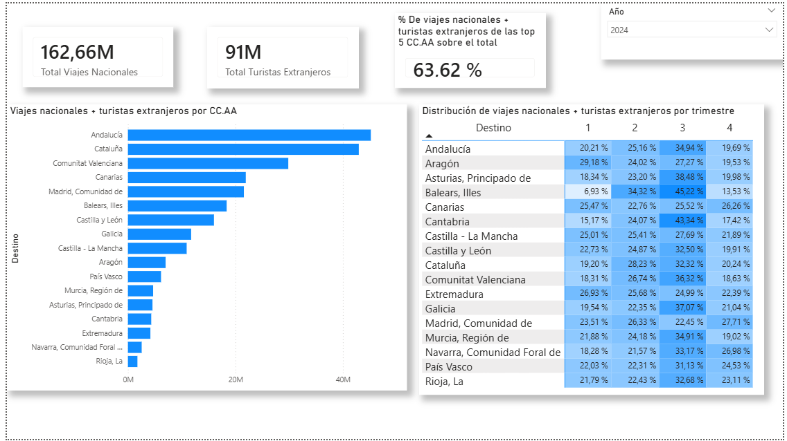
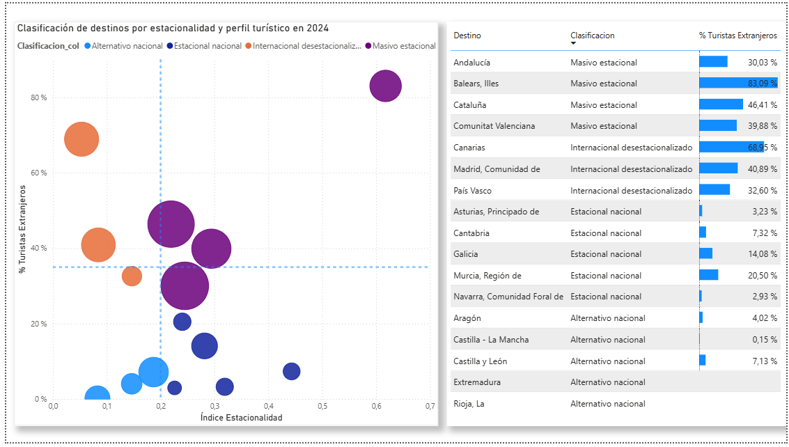
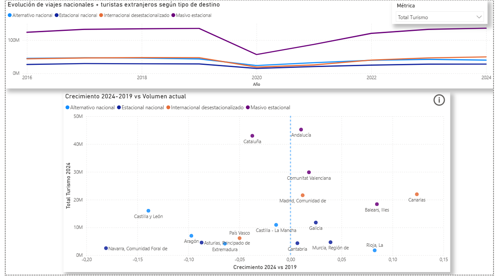
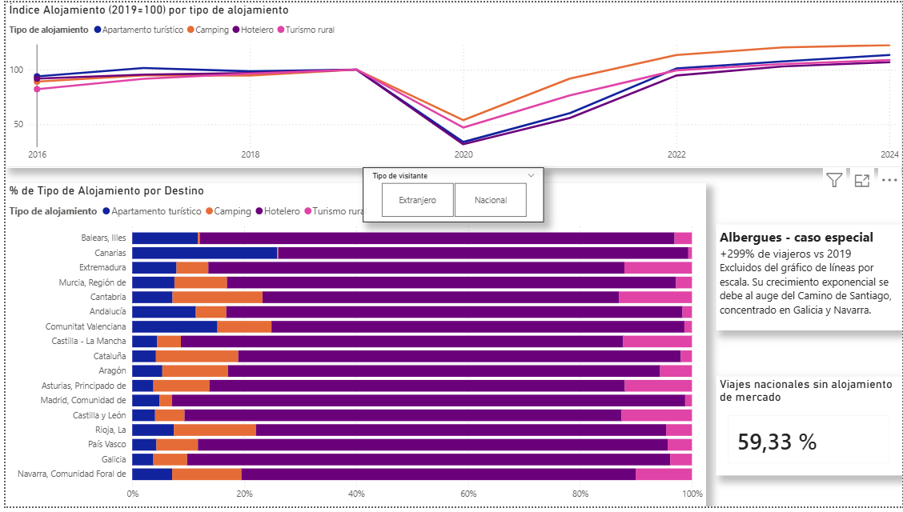
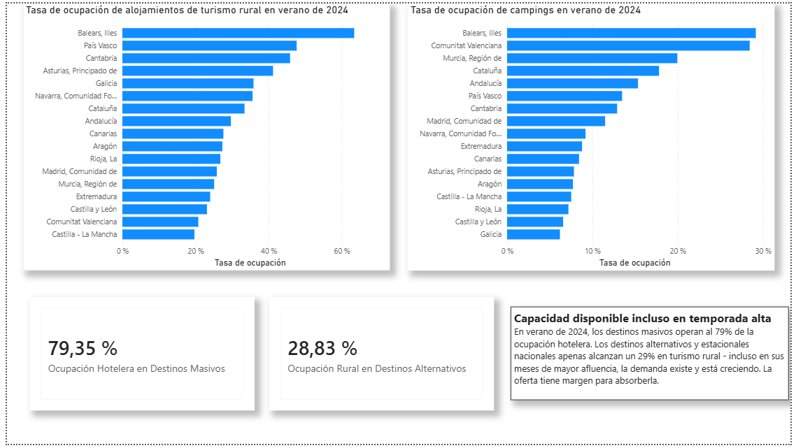

# Destinos Turísticos Alternativos en España - Análisis SQL

Análisis de destinos turísticos alternativos en España utilizando datos del INE (2015-2026), con PostgreSQL para el procesamiento y análisis de datos. El proyecto identifica qué CC.AA. ofrecen turismo menos estacional, más diversificado y con potencial de desarrollo frente a los destinos masivos tradicionales.

## Objetivos

1. **Estacionalidad**: Medir y comparar la estacionalidad turística de cada CC.AA. (coeficiente de variación trimestral y mensual)
2. **Motivaciones**: Entender por qué los turistas (nacionales y extranjeros) eligen cada destino y qué tipo de ocio buscan
3. **Comparativa**: Comparar características económicas (gasto, duración, tipo de alojamiento) entre destinos alternativos y tradicionales
4. **Evolución**: Observar tendencias 2016-2024 para detectar destinos que están cambiando de perfil
5. **Infraestructura**: Cruzar oferta (plazas) con demanda real (viajeros) para medir la presión sobre el alojamiento comercial

## Datos

Los datos provienen de cuatro encuestas del INE:

| Fuente INE | Archivo CSV | Filas staging | Periodo | Granularidad |
|------------|-------------|---------------|---------|--------------|
| ETR (Familitur) | datos_trimestrales_gasto_nacional.csv | 4.085 | 2015T1 - 2025T3 | Trimestral |
| ETR (Familitur) | motivos_turistas_residentes.csv | 3.990 | 2015 - 2024 | Anual |
| ETR (Familitur) | alojamiento_turistas_residentes.csv | 2.090 | 2015 - 2024 | Anual |
| Frontur | motivos_turistas_extranjeros.csv | 6.324 | Oct 2015 - Ene 2026 | Mensual |
| Egatur | gasto_turistas_extranjeros.csv | 760 | 2016 - 2025 | Anual |
| Enc. Ocupación | plazas_establecimientos.csv | 90.300 | Ene 2016 - Ene 2026 | Mensual |
| Enc. Ocupación | tipos_alojamiento_CC.AA.csv | 180.600 | Ene 2016 - Ene 2026 | Mensual |

- **Cobertura**: 17 CC.AA. (las ciudades autónomas Ceuta y Melilla se excluyen del análisis por volumen turístico insuficiente en las encuestas del INE)
- **Métricas**: Viajes, pernoctaciones, turistas, gasto (total, medio, diario), duración media, motivos, tipo de alojamiento, plazas estimadas, viajeros por residencia

## Estructura del proyecto

```
turismo_estacionalidad_project/
├── sql/
│   ├── 01_crear_tablas.sql          -- Creación de la BD y 6 tablas en PostgreSQL
│   ├── 02_importar_datos.sql        -- 7 staging tables + instrucciones de importación
│   ├── 03_transformar_datos.sql     -- ETL: 7 transformaciones + limpieza + verificación
│   └── 04_analisis.sql              -- 11 queries de análisis con resultados documentados
├── data_raw/                        -- CSVs originales del INE (sin modificar)
│   ├── datos_trimestrales_gasto_nacional.csv
│   ├── motivos_turistas_residentes.csv
│   ├── alojamiento_turistas_residentes.csv
│   ├── motivos_turistas_extranjeros.csv
│   ├── gasto_turistas_extranjeros.csv
│   ├── plazas_establecimientos.csv
│   └── tipos_alojamiento_CC.AA.csv
├── data_clean/                      -- Tablas exportadas tras el ETL (input del modelo Power BI)
│   ├── dim_CC.AA.csv
│   ├── gasto_trimestral_nacional.csv
│   ├── turismo_extranjeros_motivos.csv
│   ├── turismo_residentes.csv
│   ├── gasto_turistas_extranjeros.csv
│   ├── oferta_alojamiento.csv
│   └── demanda_alojamiento.csv
├── assets/
│   └── screenshots/                 -- Capturas del dashboard para la documentación
├── proyecto_estacionalidad.pbix     -- Dashboard Power BI (conecta a PostgreSQL)
└── README.md
```

## Pipeline de datos

### 1. Creación de tablas (`01_crear_tablas.sql`)

Seis tablas en PostgreSQL:

| Tabla | Fuente INE | Contenido | Periodo |
|-------|-----------|-----------|---------|
| `gasto_trimestral_nacional` | ETR | Viajes, pernoctaciones, duración, gasto total y medio (nacionales) | Trimestral |
| `turismo_residentes` | ETR | Viajes por motivo (21 categorías) y tipo de alojamiento (7 tipos) | Anual |
| `turismo_extranjeros_motivos` | Frontur | Turistas extranjeros por motivo (3 categorías) | Mensual |
| `gasto_turistas_extranjeros` | Egatur | Gasto y duración media de turistas extranjeros | Anual |
| `oferta_alojamiento` | Enc. Ocupación | Plazas estimadas por tipo de alojamiento (5 tipos) | Mensual |
| `demanda_alojamiento` | Enc. Ocupación | Viajeros y pernoctaciones por tipo, residencia (Nac/Ext) | Mensual |

Todas las tablas usan `id_ccaa` (código numérico INE) como clave de JOIN entre fuentes.

### 2. Importación (`02_importar_datos.sql`)

Enfoque de **staging tables** (7 tablas, todo como TEXT) porque los CSV del INE tienen:
- Números con formato español: puntos como separador de miles (`10.080.750`)
- Decimales con coma y puntos (`3.576.058,81`)
- Valores no disponibles representados como `.` y `..`
- Columnas constantes que se descartan (Tipo de dato, Transporte, Organización, etc.)

Encoding: LATIN1 para los 5 primeros CSV, UTF8 para los 2 de Encuestas de Ocupación (tienen BOM UTF-8).

### 3. Transformación (`03_transformar_datos.sql`)

7 transformaciones (staging → tablas finales):
- `TRIM()` + `SUBSTRING()` para quitar prefijos numéricos de CC.AA. (`"01 Andalucía"` → `"Andalucía"`)
- `REPLACE('.','')` + `REPLACE(',','.')` para formato español de números
- `CASE WHEN ... IN ('','.','..') THEN NULL` para datos no disponibles del INE
- `MAKE_DATE()` / `TO_DATE()` para convertir periodos (`2025T3` → `2025-07-01`, `2026M01` → `2026-01-01`)
- Fusión de 2 archivos en `turismo_residentes` (motivos + alojamiento), excluyendo duplicados
- Mapeo de nombres de encuesta a tipo de alojamiento simplificado (ej: `"Encuesta de Ocupación Hotelera"` → `"Hotelero"`)
- Mapeo de residencia (`"Residentes en España"` → `"Nacional"`)

Limpieza: eliminación de filas con valor NULL + DROP de las 7 staging tables.

### 4. Análisis (`04_analisis.sql`)

11 queries de complejidad progresiva, cada una con bloque RESULTADO documentado:

| # | Análisis | Objetivo | Habilidades SQL |
|---|----------|----------|-----------------|
| 1 | Perfil mensual turismo extranjero (% por mes) | Obj 1 | EXTRACT, porcentaje mensual, comparativa entre destinos |
| 2 | Perfil completo + estacionalidad + clasificación | Obj 1-5 | 6 CTEs, JOINs de 4 tablas, STDDEV/AVG (CV), CASE anidado |
| 3 | Motivos del turismo nacional (4 categorías) | Obj 2 | CASE dentro de SUM (pivot), porcentajes |
| 4 | Desglose del ocio nacional (sol y playa, cultural, naturaleza, deportivo, termal) | Obj 2 | CASE dentro de SUM, porcentajes sobre subtotal |
| 5 | Motivos del turismo extranjero (3 categorías Frontur) | Obj 2 | CTE, CASE, LIKE, porcentajes |
| 6 | Tipo de alojamiento (mercado vs no mercado, 7 subtipos) | Obj 2 | Pivot con CASE, jerarquías nivel 1/nivel 2 |
| 7 | Gasto medio: nacional vs extranjero | Obj 3 | FULL OUTER JOIN, múltiples CTEs |
| 8 | Duración media: nacional vs extranjero | Obj 3 | JOIN entre tablas, ROUND, media 2022-2024 |
| 9 | Evolución temporal 2016-2024 | Obj 4 | LAG() Window Function, 4 CTEs con LEFT JOIN |
| 10 | Destinos emergentes: 2016 → 2019 → 2024 | Obj 4 | 4 CTEs con CASE-pivot temporal, crecimiento en 2 tramos |
| 11 | Oferta vs demanda de alojamiento comercial | Obj 5 | CASE dentro de SUM/AVG, 4 CTEs con JOIN, ratios |

## Hallazgos principales

### Estacionalidad (Queries 1-2)
- **Baja estacionalidad**: Canarias (CV 6.9-9.7%), País Vasco, Madrid, Extremadura
- **Alta estacionalidad**: Baleares (CV ext 86.9%), Aragón, Asturias
- **Clasificación SQL (Q2)**: 5 CC.AA. como "Alternativo", 5 como "Tradicional masivo", 9 como "Intermedio" (sistema de 3 categorías basado en volumen, CV y % ocio)
- **Clasificación DAX (dashboard)**: sistema de 4 categorías basado en CV e internacionalización — "Masivo estacional" (Andalucía, Baleares, Cataluña, C. Valenciana), "Internacional desestacionalizado" (Canarias, Madrid, País Vasco), "Estacional nacional" (Asturias, Cantabria, Galicia, Murcia, Navarra), "Alternativo nacional" (Aragón, CLM, CyL, Extremadura, Rioja)

### Motivaciones (Queries 3-5)
- Los destinos alternativos tienen turismo diversificado: País Vasco 42.6% ocio / 13.7% negocios / 37.4% familia
- Los masivos dependen del ocio: Baleares 64.1%, Canarias 57.2%
- El turismo cultural domina en Madrid (37.1%) y País Vasco (27.5%); naturaleza en Aragón (32.0%) y Asturias (25.8%)

### Alojamiento (Query 6)
- Interior peninsular dominado por alojamiento no de mercado: CLM 71.9%, Extremadura 71.8%, CyL 70.6% (familia + propiedad)
- Mayor uso hotelero: Baleares 37.9%, Madrid 34.4%, País Vasco 29.6%

### Gasto y duración (Queries 7-8)
- Turistas extranjeros gastan 5-10x más que nacionales
- Estancias más largas en islas: Canarias 6.76 noches, Baleares 4.99; más cortas en interior: CyL 1.85, Galicia 1.87 (media 2022-2024)
- Nota metodológica: Q7 usa `anio = 2024` (dato puntual); Q8 usa `anio BETWEEN 2022 AND 2024` (media trianual) para suavizar variaciones anuales en la duración

### Evolución y destinos emergentes (Queries 9-10)
- **Galicia**: estrella emergente, turistas extranjeros casi duplicados (891K → 1.66M)
- **País Vasco**: crecimiento sostenible (+47% extranjeros), perfil diversificado estable
- **Baleares**: cada vez más dependiente de extranjeros, riesgo de concentración en ocio
- Q10 usa 3 puntos (2016→2019→2024) para separar tendencia pre-COVID del rebote post-pandemia

### Infraestructura (Query 11)
- Mayor presión comercial: Madrid (91.9), País Vasco (83.9) → necesitan más capacidad
- Menor presión: Canarias (36.4) pese a 14.7M viajeros → modelo resort eficiente (404K plazas)
- Interior con capacidad de sobra para crecer: CLM (45.6), Aragón (47.7), Asturias (48.5)

## Dashboard de Power BI (`proyecto_estacionalidad.pbix`)

El dashboard conecta directamente a PostgreSQL y visualiza los resultados del análisis SQL en 5 páginas interactivas.

### Modelo de datos

El modelo sigue un esquema en estrella con tablas de dimensión y hecho:

**Dimensiones:**
- `dim_ccaa`: 17 CC.AA. con columna calculada `Clasificacion_col` (clasificación estática basada en datos 2024)
- `dim_fecha_mensual`: Fechas mensuales con columnas de año, trimestre y mes. Conecta con las tablas de granularidad mensual y trimestral
- `dim_anio`: Serie de años (2015–2026) generada con `GENERATESERIES`. Actúa de puente entre `dim_fecha_mensual` y las tablas de granularidad anual. Es necesaria porque el modelo tiene tablas con granularidades distintas: las tablas mensuales/trimestrales se conectan a `dim_fecha_mensual`, pero las tablas anuales no tienen fecha mensual y necesitan conectarse directamente por año. Sin `dim_anio`, no habría forma de filtrar las tablas anuales desde un slicer de año compartido
- `Selector_Metrica`: Tabla desconectada (`DATATABLE`) para el slicer de métrica dinámica

**Tablas de hechos:**
| Tabla | Granularidad | Uso principal |
|---|---|---|
| `gasto_trimestral_nacional` | Trimestral | Viajes nacionales, gasto, pernoctaciones |
| `turismo_extranjeros_motivos` | Mensual | Turistas extranjeros por motivo |
| `turismo_residentes` | Anual | Motivos y alojamiento del turista nacional |
| `gasto_turistas_extranjeros` | Anual | Gasto medio del turista extranjero |
| `oferta_alojamiento` | Mensual | Plazas por tipo de alojamiento |
| `demanda_alojamiento` | Mensual | Viajeros y pernoctaciones |

### Medidas DAX

**Métricas base:**
```dax
Total Turistas Extranjeros = SUM(turismo_extranjeros_motivos[turistas])

Total Viajes Nacionales =
CALCULATE(SUM('public gasto_trimestral_nacional'[valor]),
          'public gasto_trimestral_nacional'[metrica] = "Viajes")

Total Turismo = [Total Turistas Extranjeros] + [Total Viajes Nacionales]

% Top 5 =
DIVIDE(
    CALCULATE([Total Turismo], TOPN(5, ALL(dim_ccaa), [Total Turismo], DESC)),
    CALCULATE([Total Turismo], ALL(dim_ccaa))
)

% Trimestral Total =
VAR Numerador = [Total Turismo]
VAR Denominador = CALCULATE([Total Turismo], REMOVEFILTERS(dim_fecha_mensual[trimestre]))
RETURN DIVIDE(Numerador, Denominador)

% Turistas Extranjeros = DIVIDE([Total Turistas Extranjeros], [Total Turismo])
```

**Índice de estacionalidad (Coeficiente de Variación trimestral):**
```dax
Indice Estacionalidad =
VAR T1 = CALCULATE([Total Turismo], dim_fecha_mensual[trimestre] = 1)
VAR T2 = CALCULATE([Total Turismo], dim_fecha_mensual[trimestre] = 2)
VAR T3 = CALCULATE([Total Turismo], dim_fecha_mensual[trimestre] = 3)
VAR T4 = CALCULATE([Total Turismo], dim_fecha_mensual[trimestre] = 4)
VAR Media = DIVIDE(T1 + T2 + T3 + T4, 4)
VAR Varianza = DIVIDE((T1-Media)^2 + (T2-Media)^2 + (T3-Media)^2 + (T4-Media)^2, 4)
RETURN DIVIDE(SQRT(Varianza), Media)
```

**Clasificación dinámica (para tabla):**
```dax
Clasificacion =
VAR estacionalidad = [Indice Estacionalidad]
VAR pct_ext = [% Turistas Extranjeros]
RETURN SWITCH(TRUE(),
    estacionalidad >= 0.20 && pct_ext >= 0.3, "Masivo estacional",
    estacionalidad <  0.20 && pct_ext >= 0.3, "Internacional desestacionalizado",
    estacionalidad >= 0.20 && pct_ext <  0.3, "Estacional nacional",
    estacionalidad <  0.20 && pct_ext <  0.3, "Alternativo nacional",
    "Sin clasificar")
```

**Columna calculada en dim_ccaa (para leyenda del scatter — fija 2024):**
```dax
Clasificacion_col =
VAR estacionalidad = CALCULATE([Indice Estacionalidad], dim_anio[anio] = 2024)
VAR pct_ext = CALCULATE([% Turistas Extranjeros], dim_anio[anio] = 2024)
RETURN SWITCH(TRUE(),
    estacionalidad >= 0.20 && pct_ext >= 0.3, "Masivo estacional",
    estacionalidad <  0.20 && pct_ext >= 0.3, "Internacional desestacionalizado",
    estacionalidad >= 0.20 && pct_ext <  0.3, "Estacional nacional",
    estacionalidad <  0.20 && pct_ext <  0.3, "Alternativo nacional",
    "Sin clasificar")
```

**Métrica dinámica (slicer):**
```dax
-- Tabla desconectada
Selector_Metrica = DATATABLE("Metrica", STRING,
    {{"Total Turismo"}, {"Total Turistas Extranjeros"}, {"Total Viajes Nacionales"}})

-- Medida que lee el slicer
Metrica Activa =
SWITCH(SELECTEDVALUE('Selector_Metrica'[Metrica]),
    "Total Turistas Extranjeros", [Total Turistas Extranjeros],
    "Total Viajes Nacionales",    [Total Viajes Nacionales],
    [Total Turismo])
```

**Alojamiento de mercado (Páginas 4 y 5):**
```dax
-- Viajeros totales o filtrados por residencia (slicer Nacional/Extranjero/Total)
Viajeros Mercado =
VAR seleccion = SELECTEDVALUE('public demanda_alojamiento'[residencia])
VAR filtro = IF(ISBLANK(seleccion), "", seleccion)
RETURN
CALCULATE(
    SUM('public demanda_alojamiento'[valor]),
    'public demanda_alojamiento'[metrica] = "Viajeros",
    'public demanda_alojamiento'[residencia] = filtro
)

-- Base para el índice 2019=100
Viajeros 2019 Base =
CALCULATE(
    [Viajeros Mercado],
    'public dim_fecha_mensual'[anio] = 2019
)

-- Índice para el gráfico de líneas de evolución de alojamiento
Índice Alojamiento (2019=100) = DIVIDE([Viajeros Mercado], [Viajeros 2019 Base]) * 100

-- Porcentaje del tipo de alojamiento sobre el total (gráfico 100% apilado)
% Tipo Alojamiento =
VAR total = CALCULATE(
    [Viajeros Mercado],
    ALL('public demanda_alojamiento'[tipo_alojamiento])
)
RETURN DIVIDE([Viajeros Mercado], total)

-- % de viajes nacionales con alojamiento no de mercado (2024)
% No Mercado Nacional =
VAR mercado = CALCULATE(
    SUM('public turismo_residentes'[viajes]),
    'public turismo_residentes'[motivo] = "Total",
    'public turismo_residentes'[alojamiento_nivel2] = "",
    'public turismo_residentes'[alojamiento_nivel1] IN {"De mercado", "Resto de mercado"},
    VALUE('public turismo_residentes'[anio]) = 2024
)
VAR no_mercado = CALCULATE(
    SUM('public turismo_residentes'[viajes]),
    'public turismo_residentes'[motivo] = "Total",
    'public turismo_residentes'[alojamiento_nivel2] = "",
    'public turismo_residentes'[alojamiento_nivel1] = "No de mercado",
    VALUE('public turismo_residentes'[anio]) = 2024
)
RETURN DIVIDE(no_mercado, mercado + no_mercado)
-- Resultado: 59.33%

-- Columna calculada en dim_fecha_mensual para calcular días del mes
Dias Mes = DAY(EOMONTH('public dim_fecha_mensual'[Date], 0))

-- Tasa de ocupación general (pernoctaciones / plazas×días)
Tasa Ocupacion =
VAR tipo = SELECTEDVALUE('public demanda_alojamiento'[tipo_alojamiento])
VAR destino = SELECTEDVALUE('public demanda_alojamiento'[destino])
VAR pernoctaciones = CALCULATE(
    SUM('public demanda_alojamiento'[valor]),
    'public demanda_alojamiento'[metrica] = "Pernoctaciones",
    'public demanda_alojamiento'[residencia] = ""
)
VAR plazas_dia = CALCULATE(
    SUMX(
        'public oferta_alojamiento',
        'public oferta_alojamiento'[plazas] * RELATED('public dim_fecha_mensual'[Dias Mes])
    ),
    'public oferta_alojamiento'[tipo_alojamiento] = tipo,
    'public oferta_alojamiento'[destino] = destino
)
RETURN DIVIDE(pernoctaciones, plazas_dia)

-- KPI card: ocupación hotelera masivos en verano 2024
Ocupacion Hotelero Masivos =
VAR pernoc = CALCULATE(
    SUM('public demanda_alojamiento'[valor]),
    'public demanda_alojamiento'[metrica] = "Pernoctaciones",
    'public demanda_alojamiento'[residencia] = "",
    'public demanda_alojamiento'[tipo_alojamiento] = "Hotelero",
    'dim_CC AA'[Clasificacion_col] IN {"Masivo estacional"},
    'public dim_fecha_mensual'[anio] = 2024,
    'public dim_fecha_mensual'[mes] IN {6, 7, 8}
)
VAR plazas_dia = CALCULATE(
    SUMX(
        'public oferta_alojamiento',
        'public oferta_alojamiento'[plazas] * RELATED('public dim_fecha_mensual'[Dias Mes])
    ),
    'public oferta_alojamiento'[tipo_alojamiento] = "Hotelero",
    'dim_CC AA'[Clasificacion_col] IN {"Masivo estacional"},
    'public dim_fecha_mensual'[anio] = 2024,
    'public dim_fecha_mensual'[mes] IN {6, 7, 8}
)
RETURN DIVIDE(pernoc, plazas_dia)
-- Resultado: 79.35%

-- KPI card: ocupación rural en destinos alternativos en verano 2024
Ocupacion Rural Alternativos =
VAR pernoc = CALCULATE(
    SUM('public demanda_alojamiento'[valor]),
    'public demanda_alojamiento'[metrica] = "Pernoctaciones",
    'public demanda_alojamiento'[residencia] = "",
    'public demanda_alojamiento'[tipo_alojamiento] = "Turismo rural",
    'dim_CC AA'[Clasificacion_col] IN {"Alternativo nacional", "Estacional nacional"},
    'public dim_fecha_mensual'[anio] = 2024,
    'public dim_fecha_mensual'[mes] IN {6, 7, 8}
)
VAR plazas_dia = CALCULATE(
    SUMX(
        'public oferta_alojamiento',
        'public oferta_alojamiento'[plazas] * RELATED('public dim_fecha_mensual'[Dias Mes])
    ),
    'public oferta_alojamiento'[tipo_alojamiento] = "Turismo rural",
    'dim_CC AA'[Clasificacion_col] IN {"Alternativo nacional", "Estacional nacional"},
    'public dim_fecha_mensual'[anio] = 2024,
    'public dim_fecha_mensual'[mes] IN {6, 7, 8}
)
RETURN DIVIDE(pernoc, plazas_dia)
-- Resultado: 28.83%
```

**Evolución y crecimiento:**
```dax
Metrica Indexada =
VAR Base2019 = CALCULATE([Metrica Activa], dim_anio[anio] = 2019)
RETURN DIVIDE([Metrica Activa], Base2019) * 100

Crecimiento 2019 vs 2024 =
VAR T2019 = CALCULATE([Metrica Activa], dim_anio[anio] = 2019)
VAR T2024 = CALCULATE([Metrica Activa], dim_anio[anio] = 2024)
RETURN DIVIDE(T2024 - T2019, T2019)

Total Turismo 2024 = CALCULATE([Metrica Activa], dim_anio[anio] = 2024)

-- Excluye CC.AA. con datos Frontur insuficientes cuando la métrica es Extranjeros
Crecimiento Filtrado =
VAR metrica = SELECTEDVALUE('Selector_Metrica'[Metrica])
VAR meses_2019 = CALCULATE(DISTINCTCOUNT(turismo_extranjeros_motivos[fecha]), dim_anio[anio] = 2019)
VAR meses_2024 = CALCULATE(DISTINCTCOUNT(turismo_extranjeros_motivos[fecha]), dim_anio[anio] = 2024)
VAR diferencia = ABS(meses_2024 - meses_2019)
RETURN IF(metrica = "Total Turistas Extranjeros" && diferencia >= 3, BLANK(), [Crecimiento 2019 vs 2024])
```

### Páginas del dashboard

**Página 1 — Volumen y contexto**
- Gráfico de barras horizontal: ranking de CC.AA. por Total Turismo (filtrable con slicer de año)
- Heatmap (matriz): distribución trimestral del turismo por CC.AA. (`% Trimestral Total`)
- KPI cards: Total Viajes Nacionales, Total Turistas Extranjeros, % del top 5 sobre el total

**Página 2 — Clasificación de destinos**
- Scatter plot: Índice de Estacionalidad (eje X) vs % Turistas Extranjeros (eje Y), con tamaño de burbuja proporcional al volumen y color por `Clasificacion_col`
- Líneas de referencia en X=0.20 y Y=0.30 (umbrales de clasificación)
- Tabla: CC.AA. con su clasificación y % de turistas extranjeros

**Página 3 — Evolución y crecimiento**
- Gráfico de líneas: evolución del volumen absoluto por grupo (`Clasificacion_col`) desde 2016 hasta 2024
- Scatter plot: Crecimiento 2019–2024 (`Crecimiento Filtrado`) vs Volumen 2024 (`Total Turismo 2024`), con color por `Clasificacion_col`
- Slicer de métrica: permite cambiar entre Total Turismo, Turistas Extranjeros y Viajes Nacionales
- Botón ⓘ con nota sobre disponibilidad de datos Frontur del INE

**Página 4 — Perfil de alojamiento**
- Gráfico de líneas: evolución del índice (base 2019=100) de viajeros por tipo de alojamiento (Hotelero, Apartamento turístico, Turismo rural, Camping) de 2016 a 2026. El Albergue se excluye de este visual por su crecimiento extremo (+299% vs 2019) que distorsiona la escala
- Gráfico de barras 100% apiladas: mix de alojamiento de mercado por CC.AA. en 2024, mostrando la distribución porcentual entre tipos
- KPI card: 59.33% de viajes nacionales usan alojamiento no de mercado (familia, segunda residencia), dato de `turismo_residentes` 2024
- Cuadro de texto: explica el efecto Camino de Santiago en los albergues (+299% vs 2019) y por qué se excluyen del gráfico de líneas
- Slicer de residencia (Total / Nacional / Extranjero) centrado en el espacio entre los dos gráficos

**Página 5 — Oferta y Ocupación**
- Gráfico de barras horizontal: tasa de ocupación rural por CC.AA. en verano 2024 (junio–agosto), filtrado a los grupos "Alternativo nacional" y "Estacional nacional"
- Gráfico de barras horizontal: tasa de ocupación de camping por CC.AA. en verano 2024 (junio–agosto), mismo filtro de grupos
- KPI card: 79.35% — ocupación hotelera media en destinos "Masivo estacional" (verano 2024)
- KPI card: 28.83% — ocupación rural/camping media en destinos alternativos (verano 2024)
- Cuadro de texto: conclusión narrativa del dashboard — los destinos alternativos tienen capacidad de absorción sin colapso de infraestructura, a diferencia de los masivos que operan cerca del límite en temporada alta

### Vista previa

**Página 1 — Volumen y contexto**


**Página 2 — Clasificación de destinos**


**Página 3 — Evolución y crecimiento**


**Página 4 — Perfil de alojamiento**


**Página 5 — Oferta y ocupación**


### Decisiones de diseño

**Coeficiente de Variación como índice de estacionalidad**: Se evaluó inicialmente el ratio T3/T1 (turismo pico verano / turismo valle invierno) pero no existe un umbral estándar en la literatura para interpretarlo. Se investigaron fuentes académicas y del INE y se adoptó el **Coeficiente de Variación (CV) trimestral**, definido como la desviación típica de los 4 trimestres dividida entre la media, que sí tiene respaldo metodológico en estudios de estacionalidad turística y permite comparar destinos con distribuciones muy distintas (insulares vs. de interior, por ejemplo). Umbrales adoptados (CV expresado como porcentaje): CV < 25% = baja estacionalidad; CV < 40% = media; CV ≥ 40% = alta. Para la clasificación de destino (`clasificacion`), el umbral de "Alternativo" usa CV < 30%, ligeramente más permisivo que el de "Baja" (25%), porque la clasificación combina estacionalidad con volumen total y diversificación de motivos — un destino puede ser "Alternativo" aunque no alcance el nivel más estricto de "Baja" estacionalidad.

**Columna calculada vs medida para la clasificación**: La medida `Clasificacion` es dinámica (cambia con el año seleccionado) y se usa en la tabla. La columna calculada `Clasificacion_col` está fija a datos de 2024 y se usa en las leyendas de color de los scatter plots, donde Power BI requiere una columna para colorear puntos de forma estable.

**Slicer de métrica con DATATABLE**: El parámetro nativo de Power BI (tipo Fields) generó errores de modelo (`composite key`, `MdxScript`). Se sustituyó por una tabla calculada manual con `DATATABLE` y una medida `Metrica Activa` con `SWITCH(SELECTEDVALUE(...))`.

**Datos Frontur del INE**: El INE suprime datos mensuales de turistas extranjeros cuando la muestra es demasiado pequeña (confidencialidad estadística). Esto afecta principalmente a Extremadura, La Rioja, Navarra, Castilla-La Mancha y Aragón. La medida `Crecimiento Filtrado` excluye automáticamente CC.AA. con diferencia de meses disponibles ≥ 3 entre 2019 y 2024, evitando mostrar crecimientos distorsionados. El análisis de clasificación no se ve afectado significativamente (solo el 2.7% del turismo extranjero nacional queda sin capturar).

**Índice base 2019=100 en gráfico de líneas (Página 3)**: Las 4 líneas del gráfico de evolución tienen volúmenes muy distintos (Masivo estacional ~130M vs Alternativo nacional ~30M). El índice permite comparar la recuperación post-COVID de cada grupo independientemente de su tamaño absoluto. El volumen absoluto se muestra directamente, no indexado, para mantener la perspectiva de escala.

**Doble conteo en Viajeros Mercado**: La tabla `demanda_alojamiento` contiene tres filas por cada combinación destino/tipo/mes: residencia = "" (total), "Nacional" y "Extranjero". Sin filtro, sumar todo da el doble del valor real. Se usa `SELECTEDVALUE` con default `""` para usar siempre la fila de total pre-agregada cuando no hay slicer activo, y la fila nacional o extranjero cuando el slicer está seleccionado.

**Albergue excluido del gráfico de líneas de alojamiento (Página 4)**: El índice del albergue supera 400 en 2024 (+299% vs 2019) por el boom del Camino de Santiago, distorsionando la escala y haciendo ilegibles los demás tipos. Se excluye del visual y se explica mediante un cuadro de texto. En el gráfico de barras apiladas sí se incluye (representa el 2.9% del total, comparable al rural 3.2%).

**Tasa de ocupación con SELECTEDVALUE vs medidas explícitas**: La medida genérica `Tasa Ocupacion` usa `SELECTEDVALUE` para obtener el tipo y destino del contexto de fila, lo que funciona en gráficos de barras pero devuelve BLANK en cards (sin contexto de fila). Para los KPI cards de Página 5 se crearon medidas dedicadas (`Ocupacion Hotelero Masivos`, `Ocupacion Rural Alternativos`) con filtros hardcodeados.

**Filtro de verano (junio–agosto) en Página 5**: La ocupación anual media oculta la saturación estacional. Filtrando a junio–agosto 2024 la diferencia se vuelve visible: 79% hotelero masivos vs 28% rural alternativos. Esto refuerza la narrativa central del dashboard: los destinos alternativos tienen capacidad ociosa incluso en temporada alta.

**Clasificación "Estacional nacional" incluida en ocupación rural**: El grupo "Alternativo nacional" solo incluye 5 CC.AA. (País Vasco, Madrid, Navarra, Extremadura, Canarias). Se amplió a incluir "Estacional nacional" (Galicia, Cantabria, Asturias, Murcia...) porque comparten el perfil de alojamiento rural/camping aunque tengan alta estacionalidad. Sin este grupo la muestra es demasiado pequeña para representar a los destinos alternativos en su conjunto.

## Tecnologías

- **PostgreSQL 17** + pgAdmin 4
- **SQL**: DDL, DML, CTEs (hasta 6 en una query), Window Functions (LAG, STDDEV, AVG), JOINs (LEFT, FULL OUTER), CASE anidado, EXTRACT, MAKE_DATE, TO_DATE, ROUND, COALESCE, NULLIF
- **Power BI Desktop**: Modelo estrella, DAX (medidas, columnas calculadas, tablas calculadas), Power Query

## Autor

**Andrés Liz Domínguez** - Marzo 2026
